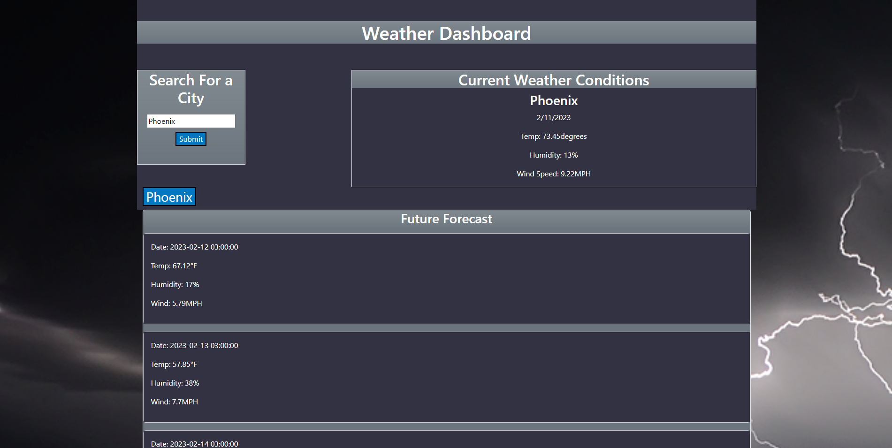

# Weather Dashboard

## Description

This application shows the current weather and future weather of a city of choice. It was created to help someone make plans for a future trip. From this project I learned how to pull information from an API and display that information on a webpage.

## Installation

Please go to the following website to enter the application.

Website URL: https://hoeferg.github.io/weather-dashboard/
## Usage

In the cities entry box put a city that you would like to know the weather of. From there the current weather information and future weather information will display. If you would like to view a previous city click on the button of the city below.



## Installation


1. Clone the repo
   ```sh
   git clone [https://github.com/hoeferg/GaylePortfolio](https://github.com/hoeferg/weather-dashboard)
   ```
2. Install NPM packages
   ```sh
   npm install
   ```
3. Start the application
   ```sh
   npm start


## License

No license

---

## Contact
Gayle Hoefer - [LinkedIn](https://www.linkedin.com/in/gayle-hoefer-61a2a3124/) - [Github](https://github.com/hoeferg)

